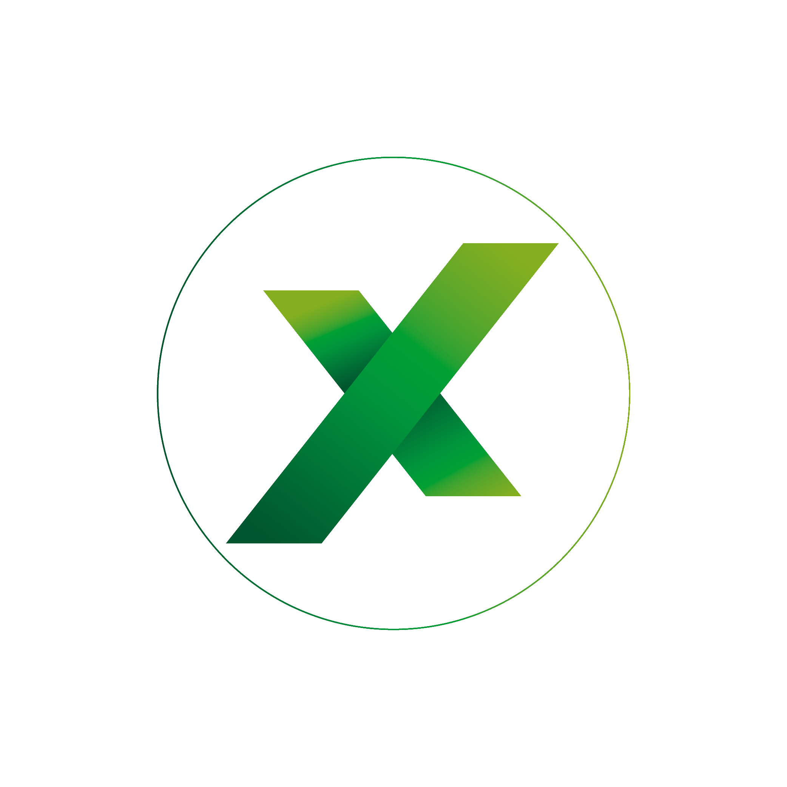

# Novixel Portfolio Design System v4

**Last Updated:** February 21, 2026  
**Applies to:** `index.html` (portfolio page) using `style.css` + `script.js`

---

## Design Philosophy

- **Dark "polished terminal" aesthetic** with cyberpunk accents
- **Pure black backgrounds** with neon green primary accent
- **Cyan/teal highlights** for interactive elements
- **Subtle amber accents** for warmth
- **Clean typography and spacing** — professional but edgy
- **Security-first, reliability-focused** messaging

---

## Color Palette

### Light Mode
```css
--bg: #f0f0f0;
--panel: #ffffff;
--panel2: #f8f8f8;
--border: #ddd;
--text: #333;
--muted: #666;
--accent: #00ff66;
```

### Dark Mode (v4 — Polished Terminal)
```css
--bg-dark: #0a0a0a;          /* Slightly lighter than pure black */
--panel-dark: #111111;        /* Card backgrounds */
--panel2-dark: #0d0d0d;       /* Secondary panels */
--border-dark: #1e1e1e;       /* Subtle borders */
--text-dark: #00ff00;         /* Bright neon green */
--muted-dark: #b0b0b0;        /* Light grey for body text */
--accent: #00ff66;            /* Primary green */
--accent-light: #00ff66;      /* Bright green */
--accent-dark: #00cc55;       /* Darker green */
--accent-amber: #fbbf24;      /* Warm accent */
--accent-teal: #2dd4bf;       /* Cyan/teal for highlights */
```

### Background Gradient (Dark Mode v4)
```css
background: 
    radial-gradient(circle at 20% 80%, rgba(57, 255, 136, 0.02), transparent 50%),
    radial-gradient(circle at 80% 20%, rgba(251, 191, 36, 0.015), transparent 50%),
    var(--bg-dark);
```

**Rationale:** Subtle dual-gradient creates depth without overwhelming. Green glow bottom-left, warm amber glow top-right.

---

## Typography

- **Font Stack:** `system-ui, -apple-system, Segoe UI, Roboto, Arial, sans-serif`
- **Line Height:** `1.55`
- **H1:** 34px (26px mobile) — Bright green (#00ff00)
- **H2:** 22px — Light grey (#e2e8f0)
- **H3:** 16px — Accent green
- **Body:** 1em (16px base)
- **Muted Text:** Light grey (#b0b0b0) for paragraphs and descriptions
- **Small/Muted:** 13px
- **Tiny:** 12px
- **Radius:** 12px (slightly tighter than v3)

---

## Component Patterns

### Header Layout
```html
<header class="header">
    <button class="logoBtn">
        
    </button>
    <div class="headline">
        <h1>Find Your Solution</h1>
        <p class="subhead">
            Tagline here.
            <span class="location">Dawson Creek, BC</span>
        </p>
    </div>
    <button class="iconBtn fas fa-moon" onclick="toggleDarkMode(event)"></button>
</header>
```

**Dark Mode Styling:**
- Location badge: Cyan border (#00ffff) with subtle glow
- Icon button: Pure black gradient background

### Tab Navigation
```html
<nav class="tab" role="tablist">
    <button class="tablinks" role="tab" aria-selected="true" aria-controls="Home" id="tab-Home" onclick="openTab(event, 'Home')">Home</button>
    <!-- More tabs... -->
</nav>
```

**Dark Mode Styling:**
- Default: Pure black background (rgba(0,0,0,.75))
- Active: Green tint background (rgba(57, 255, 136, 0.1)) with bright green border

### Cards
```html
<!-- Hero card (main content) -->
<div class="heroCard">...</div>

<!-- Standard card -->
<div class="card">...</div>

<!-- Mini card (grid items) -->
<div class="miniCard">...</div>

<!-- Service card (3-column grid) -->
<article class="serviceCard">...</article>
```

**Dark Mode Styling (v4):**
- Background: Pure black (rgba(0,0,0,.35-.92) depending on card type)
- Hover: Green border glow (rgba(57, 255, 136, 0.3)) with subtle lift animation
- Icons: Bright green accent color
- Price text: Green with subtle glow
- Bullet markers: Green accent color

### Pills/Tags
```html
<div class="pillRow">
    <span class="pill">Automation & APIs</span>
    <span class="pill">Web Apps</span>
</div>
```

**Dark Mode Styling (v4):**
- Border: Subtle green (rgba(57,255,136,.15))
- Background: Very transparent green (rgba(57,255,136,.06))
- Text: Bright green (rgba(57,255,136,.9))

### Trust Block
```html
<div class="trustBlock">
    <span><i class="fas fa-map-marker-alt"></i> Local in Dawson Creek</span>
    <span><i class="fas fa-bolt"></i> Fast Turnaround</span>
    <span><i class="fas fa-tag"></i> Clear Pricing</span>
    <span><i class="fas fa-comments"></i> No Jargon</span>
</div>
```

### CTA Buttons
```html
<div class="ctaRow">
    <a class="btn primary" href="#contact">Get a Quote</a>
    <a class="btn ghost" href="https://example.com">Secondary Action</a>
</div>
```

**Dark Mode Styling (v4 — Cyan Primary):**
```css
/* Primary button */
.btn.primary {
    border-color: rgba(0, 255, 255, 0.5);
    background: linear-gradient(180deg, rgba(0, 255, 255, 0.12), rgba(0,0,0,.9));
    color: #00ffff;
    text-shadow: 0 0 10px rgba(0, 255, 255, 0.3);
}

.btn.primary:hover {
    border-color: rgba(0, 255, 255, 0.8);
    box-shadow: 0 0 24px rgba(0, 255, 255, 0.2);
    transform: translateY(-1px);
}

/* Ghost button */
.btn.ghost {
    border-color: rgba(255,255,255,.1);
    color: var(--accent-light);
}

.btn.ghost:hover {
    border-color: rgba(57,255,136,.35);
    background: rgba(57,255,136,.05);
}
```

**Rationale:** Cyan for primary actions creates visual hierarchy. Green for ghost/secondary keeps brand consistency.

### Process Steps
```html
<div class="processSection">
    <h3>How It Works</h3>
    <div class="processSteps">
        <div class="processStep">
            <span class="stepNumber">1</span>
            <strong>Message</strong>
            <p class="muted">Send details about what you need</p>
        </div>
        <!-- Steps 2, 3... -->
    </div>
</div>
```

### Service List
```html
<ul class="serviceList">
    <li><strong>Service Name</strong> — brief description</li>
</ul>
```

### Contact Form
```html
<form id="contactForm" class="contactForm" action="mailto:novixel@hotmail.com" method="POST" enctype="text/plain">
    <label for="name">Name</label>
    <input type="text" id="name" name="name" autocomplete="name" required>
    <!-- More fields... -->
    <div class="ctaRow">
        <input class="btn primary" type="submit" value="Send Message">
        <a class="btn ghost" href="https://calendly.com/novixel">Book a Call</a>
    </div>
</form>
```

### Footer
```html
<footer class="footer">
    <hr class="separator">
    <div class="footerLinks">
        <a href="Novixel.html">Portfolio</a>
        <a href="tradingbots.html">Trading Solutions</a>
        <a href="https://try.novalite.app" target="_blank" rel="noopener">NovaLite</a>
        <a href="aicom.html">AI Solutions</a>
    </div>
    <p class="tiny muted">&copy; 2026 Novixel. All rights reserved.</p>
</footer>
```

---

## Interaction & Animation Patterns (v4)

### Hover States
All interactive elements use consistent hover patterns:

**Cards:**
```css
/* Lift + glow */
transform: translateY(-2px);
box-shadow: 0 0 20px rgba(57, 255, 136, 0.08);
border-color: rgba(57, 255, 136, 0.3);
transition: all 0.3s ease;
```

**Buttons:**
```css
/* Cyan primary */
transform: translateY(-1px);
box-shadow: 0 0 24px rgba(0, 255, 255, 0.2);
border-color: rgba(0, 255, 255, 0.8);

/* Green ghost */
background: rgba(57,255,136,.05);
border-color: rgba(57,255,136,.35);
```

**Links:**
```css
/* Subtle color shift */
color: var(--accent-light);
transition: color 0.3s ease;
```

### Visual Effects

**Service Cards:**
- Unified green glow on hover (not individual colors per card)
- Icons use primary accent color
- Price/strong text highlighted in accent green
- Bullet markers match accent color

**Featured Banner:**
- Green border (rgba(0,255,102,.3))
- Subtle bottom gradient line
- Lift animation on hover with enhanced glow

**Location Badge:**
- Cyan color (#00ffff) with matching border
- Subtle box-shadow glow (rgba(0, 255, 255, 0.15))

---

## Grid Layouts

### 2-Column Grid (Skills)
```css
.grid2 {
    display: grid;
    grid-template-columns: repeat(2, minmax(0, 1fr));
    gap: 12px;
}
```

### 3-Column Grid (Services)
```css
.serviceGrid {
    display: grid;
    grid-template-columns: repeat(3, minmax(0, 1fr));
    gap: 12px;
}
```

### Responsive Breakpoint
At `860px`, both grids collapse to single column.

---

## JavaScript Functions

| Function | Purpose |
|----------|---------|
| `toggleDarkMode(event)` | Toggle dark mode class on body |
| `openTab(evt, tabName)` | Switch between tab panels |
| `jumpToContact(e)` | Scroll to contact section |
| `scrollToTop()` | Smooth scroll to page top |
| `CoolThing()` | Easter egg: swap logo images |
| `initContactForms()` | Enhance mailto forms with subject prefix |

---

## Copy Guidelines

### Voice (v4 Update)
- **Confident, not arrogant**
- **Technical, not complex**
- **Direct, not sparse**
- **Professional with edge** (polished terminal aesthetic)
- **Clear value proposition** (speed, cost, reliability)

### Tone Keywords
- Fast, efficient, reliable
- Clean, tested, documented
- No bullshit, no overhead
- Terminal-style directness

### Avoid
- Hype language ("revolutionary", "game-changing")
- Excessive emoji (checkmarks ✓ OK in lists)
- Passive voice
- Vague timelines
- Corporate speak

### Good Examples
- "Clear communication. Fast troubleshooting. Clean solutions that don't fall apart later."
- "Typical turnaround: same day to 3 days depending on scope."
- "If you can explain the outcome you want, I can map the steps and build the solution."
- "Turbocharge your OpenClaw assistant — 50-100x faster, 60-90% cheaper."

---

## Design System Changelog

### v4 (February 21, 2026) — Polished Terminal
**Major Changes:**
- Pure black backgrounds (rgba(0,0,0) instead of blue-grey)
- Bright neon green (#00ff00) for primary text
- Cyan accents (#00ffff) for interactive elements (buttons, location badge)
- Light grey (#b0b0b0) for body text (improved readability)
- Added amber accent (#fbbf24) for subtle warmth
- Tighter border radius (12px)
- Unified hover states across all components
- Enhanced glow effects on interactive elements

**Rationale:**
- Pure black creates stronger contrast and more professional look
- Cyan primary buttons create clear visual hierarchy
- Green remains brand color but used more strategically
- Improved text readability with proper grey tones

### v3 (January 9, 2026) — Console/Hacker Vibe
- Blue-grey backgrounds
- Subtle green accents
- Professional polish

---

## File Dependencies

```
Novixel.html
├── style.css?v=3
├── script.js?v=2
├── FavIcon.png
├── Novixel-icon-Trans1.png
├── Novixel-icon-Trans2.png
└── Font Awesome 5.15.3 (CDN)
```

---

## Hidden Pages (Not in Navigation)

- `coffee.html` — Coffee Solutions business plan
- `novatrade.html` — Enterprise trading platform
- `bots.html` — Trading bots detail page

---

## Future Improvements

1. Replace mailto form with Formspree/Netlify Forms
2. Add mini portfolio section (2-3 project screenshots)
3. Add testimonials block
4. Consider adding subtle animations (intersection observer)
